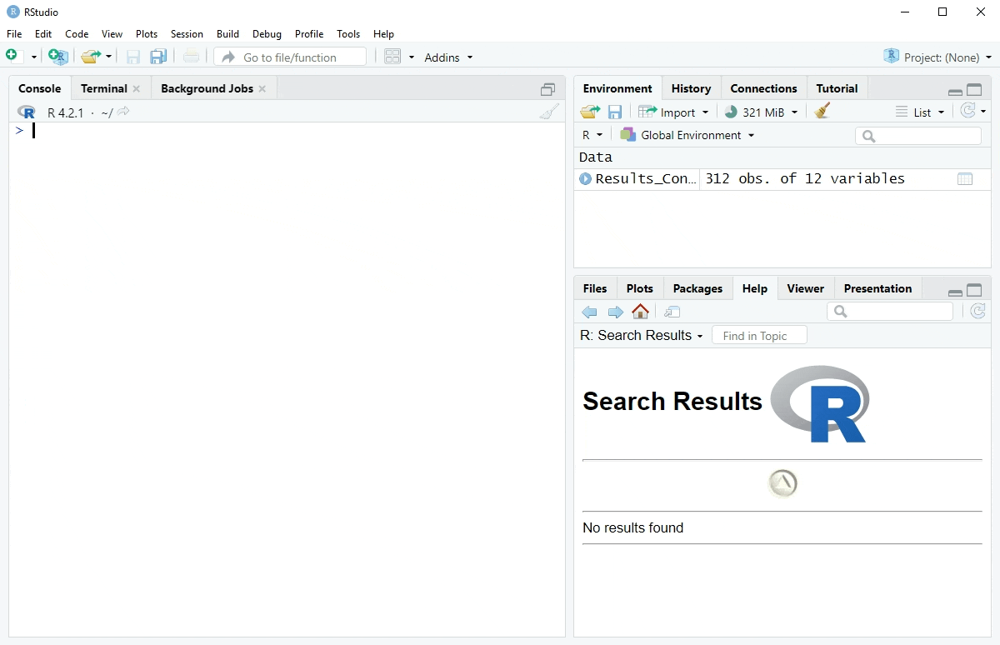
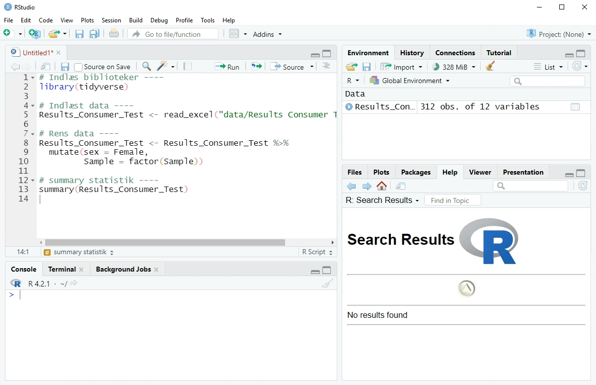

---
# Please do not edit this file directly; it is auto generated.
# Instead, please edit 02-organisering.md in _episodes_rmd/
 title: "Organiser dit arbejde"
teaching: 10
exercises: 5
questions:
- "Hvordan kan man lave overskuelig kode"
- "Hvordan kan man nemt dele sin kode"
objectives:
- "Lær at arbejde i projekter i RStudio"
- "Sørg for at din kode er overskuelig"
- "Husk at rydde op i din kode"
keypoints:
- "Lav projekter"
- "Inddel din kode"
- "Gennemgå din kode og ryd op"
source: Rmd
---

# Hvad er et script
Et script er en sekvens af instruktioner som oversætter et problem og kommer med et resultat. Gode scripts kan køres fra start til slut og give et resultat uden problemer og fejl.

Programmeringsprocessen er ikke altid struktureret, men gode scripts kan opnås med gode programmeringsrutiner.

Gode programmeringsrutiner kan i starten virke omstændeligt, men jo større programmeringsprojektet er jo vigtigere er det med gode rutiner. Man bestemmer helt selv hvordan man vil programmere, men her kommer nogle tips og tricks som vi med møje og besvær har lært gør processen lidt lettere.

> ## Ja, det er faktisk programmering
>
> Ordet programmering kan godt lyde lidt fjernt fra hvad vi egentlig laver
> når vi analyserer data ved hjælp af R.
> Men det er faktisk programmering. Derfor prøver vi at lære af "rigtige"
> programmører. De har gjort sig nogen nyttige erfaringer!
{: .callout}

# Gode programmeringsrutiner
## Projekter
Opfat din programmeringsopgave som et projekt.

I Rstudio er det muligt at oprette projekter. Når man opretter et projekt i RStudio, så oprettes der en mappe på computeren hvor man kan gemme alle scripts, data, plot mv. som har med projektet at gøre. Denne mappe opfattes nu som projektets "Working directory". Alle scripts i denne mappe kan nu bruge relative stier (paths) til filer, hvilket gør det nemt at dele sit projekt med andre eller flytte det til en ny computer. Dette gøres ved at overføre hele projektmappen. Så hvis man sender sin projekt mappe til en anden, så bør koden kunne eksekveres uden store problemer.

Arbejd med mere end et projekt. I det øjeblik to opgaver ikke har noget med hinanden at gøre og derfor kan løses uafhængigt af hinanden, bør man overveje at etablere to projekter.

## Mappestruktur
Lav en overskuelig mappestuktur indefor din projektmappe. Strukturen skal håndtere forskellige typer af data, fx scripts, rå data, manipulerede data, plots, adskildt. Her under er et eksempel på en fuldt udbygget mappestruktur. 

Det er ikke altid nødvendigt med hele denne struktur, man kan nøjes med de mapper der giver mening for ens projekt.

## Brug kode til at indlæse data
Det er fristende at bruge importfunktionen til at indlæse data. Den er også fin.

Men læg mærke til at du hver gang du bruger den skal interagere med RStudio og derfor ikke opnår et script der kan køres fra start til slut.

Indlæs i stedet filen med kommandoer i et script:

~~~
library(readxl)
Results_Consumer_Test <- read_excel("R_projekter/R-refresh-fda/data/Results Consumer Test.xlsx")
~~~
{: .language-r}

Hvis du sørger for at gemme data i en data-mappe i din RStudio projektmappe, og indlæser herfra, sikrer du at data altid følger med projektet.

## Husk at kommentere
Kommentarer er din ven. De hjælper dig med at gennemskue hvad du har lavet når du kigger på din kode igen (måske omkring eksamenstid), eller 1 år senere fordi du skal lave noget lignende. De giver dig mulighed for hurtigt at gennemskue hvorfor du har gjort hvad.

Kommentarer kan være svære at skrive både fordi de kan forstyrre programmeringsprocessen, og fordi det virker åbenlyst hvad man sidder og laver. Det kan ofte være en god ide at gennemgå ens kode enten når man stopper for dagen eller er færdig med et problem og så få skrevet kommentarer. Denne proces kan også hjælpe til at man lige får set på koden en ekstra gang.

Kommentarer i R skal markeres på en særlig måde. Ellers vil R forsøge at
fortolke kommentarerne som kode. Og det går sjældent godt. Vi markerer
at noget er en kommentar ved at sætte # foran teksten:

~~~
# Her viser vi hvordan man laver en kommentar
# Det er en kommentar til en beregning af gennemsnittet af 100 tilfældige
# normalfordelte tal med middelværdi lig 0, og standardafvigelse lig 1: 
mean(rnorm(100))
~~~
{: .language-r}

~~~
[1] -0.03310542
~~~
{: .output}

~~~
# Bemærk at det er tilfældige tal, så dit resultat er med stor sandsynlighed
# forskelligt fra dette. Man kan bruge funktionen set.seed() til at kontrollere
# sandsynlighedsgeneratoren. Læs mere i dokumentationen til den
~~~
{: .language-r}
Har man allerede skrevet en kommentar på flere linier, men ikke sat # foran 
linierne, kan man markere teksten, og trykke ctrl+shift+c - så forvandles 
hele markeringen til en kommentar.

## Oprydning
Det kan være en god ide løbende at rydde op i ens kode, så man kan slette unødvendig kode. Det kan være en kedelig proces, men man sørger for at koden bliver mere brugbar for en selv i fremtiden, og man får også lige lov til at tjekke igennem om koden nu også er skrevet sekventiel.

# Kodeprocessen
Husk at scripts eksekveres linie for linie. Skriv derfor koden i den rækkefølge I mener den skal køres. Hvis vi skal bruge værdien af en variabel i en beregning - så skal variablen tildeles en værdi før vi bruger den.

Kald til libraries placeres med fordel som det allerførste i scriptet. Dette giver et godt overblik over hvilke pakker der bruges i scriptet, og hvis du får brug for at køre library igen, så ved du hvor koden står.

install.packages() kan være rart at have med i scriptet. Men det er ikke noget I har brug for at køre hver eneste gang scriptet skal køres. Så udkommenter de linier kode.

En god praksis kan være:

~~~
# i dette script analyserer jeg hvilke sensoriske parametre der har betydning 
# for vurderingen af smagen af oste.

library(tidyverse)
library(ggbiplot)

df <- read.csv("data/mine_data.csv")

summary(df)

# Ovenstående kode fungerer
# herunder eksperimenterer jeg

eksempelkode
~~~
{: .language-r}

Under kommentaren "herunder eksperimenterer jeg" skriver du kode, ser om den virker. Kigger på resultatet og overvejer om det giver mening. Og når du er tilfreds med resultatet, flytter du det op over kommentaren "Ovenstående kode fungerer".

Målet er at have et script der, når det er færdigt, kan køres linie for linie fra 
start til slut, og give dig de resultater, grafer osv du har brug for.

## Inddel din kode i sektioner
For at gøre ens projekt mere overskueligt kan man med fordel lave flere scripts filer. Derudover kan det indenfor et script være nyttigt at organisere sin kode i sektioner:

~~~
# indlæs biblioteker ----

# indlæs data ----

# rens data ----

# analyser data ----

# plot data ----
~~~
{: .language-r}

Her er et forslag til nogle sektioner som kan være anvendelige. Det smarte er også at disse kodesektioner kan "foldes sammen" så de ikke forstyrrer blikket når man programmerer.


