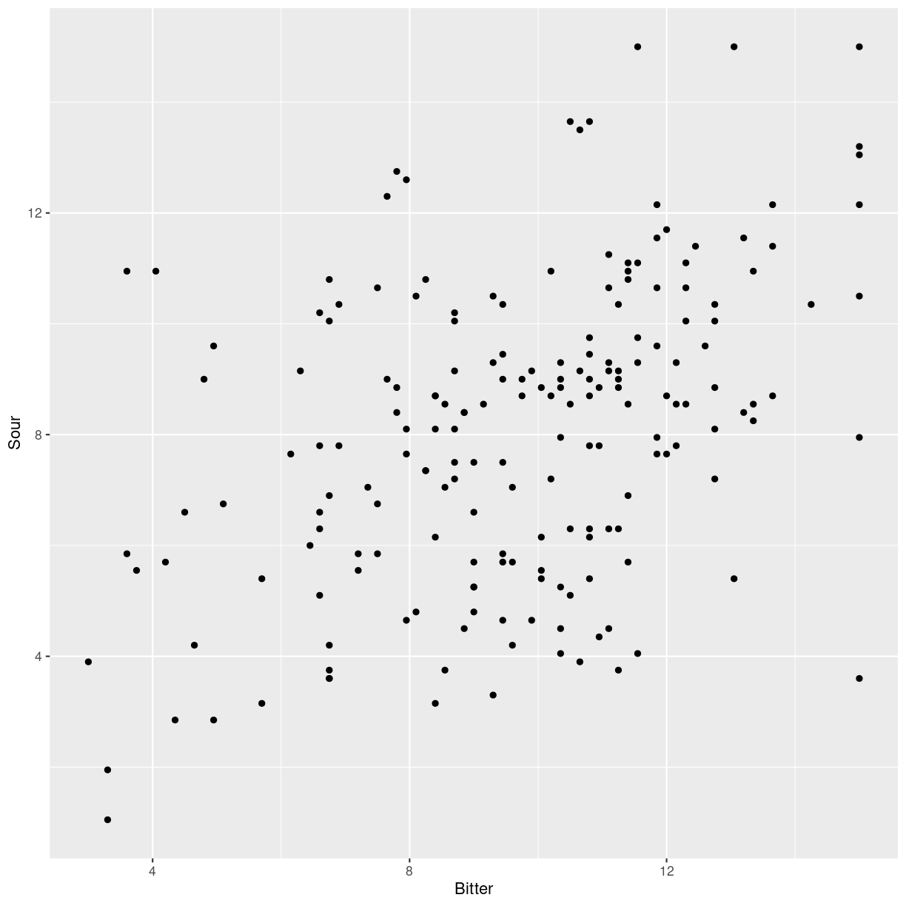

---
# Please do not edit this file directly; it is auto generated.
# Instead, please edit 05-summary-stat.md in _episodes_rmd/
title: "summary statistics"
teaching: 10
exercises: 5
questions:
- "FIX ME"
objectives:
- "FIX ME"
keypoints:
- "FIX ME"

source: Rmd
---

## Summary statistics

I vil ofte skulle finde gennemsnit, medianer, standardafvigelser og
andet for jeres data. Og ofte for forskellige grupper. Et af de
første eksempler I kommer til at arbejde med er smagsdommeres 
vurderinger af smagen af kaffe. Og en ting man kunne have lyst til at 
finde ud af om tre forskellige smagsdommere vurderer bitterheden af 
kaffen forskelligt.

Lad os indlæse data:

~~~
kaffe <- read_excel("../data/Results Panel.xlsx")
kaffe
~~~
{: .language-r}

~~~
# A tibble: 192 × 11
   Sample Assessor Replicate Intensity  Sour Bitter Sweet Tobacco Roasted Nutty
   <chr>     <dbl>     <dbl>     <dbl> <dbl>  <dbl> <dbl>   <dbl>   <dbl> <dbl>
 1 31C           1         1      9.3   6.9    6.75  4.5     10.5    7.95  3.9 
 2 31C           1         2      8.7   8.1    7.95  4.35     9.6    8.85  4.8 
 3 31C           1         3      9.75  8.7   10.2   3.9     10.2   10.2   4.8 
 4 31C           1         4     11.7  11.0   11.4   3.15    11.6   10.0   3.45
 5 31C           2         1      8.7   5.7   11.4   6.15    10.6    8.85  1.95
 6 31C           2         2      8.7   9.3   10.4   4.95    11.7   11.0   5.4 
 7 31C           2         3      7.95  9     11.2   1.2     11.1    8.85  4.8 
 8 31C           2         4     10.6  10.0   12.8   1.05    12.3   10.5   1.2 
 9 31C           3         1      8.25  8.85  11.2   4.8     12.8    2.7   2.4 
10 31C           3         2      9.15  8.25  13.4   4.5     13.5    4.8   5.7 
# ℹ 182 more rows
# ℹ 1 more variable: Chocolate <dbl>
~~~
{: .output}

Man kan få et hurtigt overblik ved hjælp af funktionen `summary`:

~~~
summary(kaffe)
~~~
{: .language-r}

~~~
    Sample             Assessor      Replicate      Intensity     
 Length:192         Min.   :1.00   Min.   :1.00   Min.   : 0.750  
 Class :character   1st Qu.:2.75   1st Qu.:1.75   1st Qu.: 7.650  
 Mode  :character   Median :4.50   Median :2.50   Median : 9.450  
                    Mean   :4.50   Mean   :2.50   Mean   : 9.338  
                    3rd Qu.:6.25   3rd Qu.:3.25   3rd Qu.:11.287  
                    Max.   :8.00   Max.   :4.00   Max.   :15.000  
      Sour            Bitter           Sweet           Tobacco      
 Min.   : 1.050   Min.   : 3.000   Min.   : 0.000   Min.   : 0.900  
 1st Qu.: 5.850   1st Qu.: 7.950   1st Qu.: 1.800   1st Qu.: 7.763  
 Median : 8.400   Median :10.050   Median : 3.450   Median :10.200  
 Mean   : 8.044   Mean   : 9.665   Mean   : 3.553   Mean   : 9.627  
 3rd Qu.:10.050   3rd Qu.:11.400   3rd Qu.: 4.950   3rd Qu.:11.550  
 Max.   :15.000   Max.   :15.000   Max.   :12.000   Max.   :15.000  
    Roasted           Nutty         Chocolate     
 Min.   : 1.200   Min.   :0.600   Min.   : 1.050  
 1st Qu.: 7.463   1st Qu.:2.550   1st Qu.: 5.513  
 Median : 9.750   Median :4.050   Median : 7.350  
 Mean   : 9.101   Mean   :4.154   Mean   : 7.426  
 3rd Qu.:10.988   3rd Qu.:5.287   3rd Qu.: 9.450  
 Max.   :15.000   Max.   :9.900   Max.   :15.000  
~~~
{: .output}
En lidt irriterende ting ved dette datasæt er at kolonnen `Sample`
indeholder temperaturen. Men angivet ikke som `31` og så underforstået
i grader Celsius, men i stedet som `31C`. Det er selvfølgelig en 
fiks måde at få angivet at vi arbejder med forskellige samples, der
er karakteriseret ved at være ved forskellige temperaturer.
Men det betyder at vi ikke kan lave matematik på temperaturerne, og det har vi undertiden lyst til.

Nu kunne vi så godt tænke os at finde ud af om de otte smagsdommere
vurderer eksempelvis bitterhed forskelligt. Er der nogen af dem
der er mere "følsomme" overfor bitterhed end andre. Det kan vi få en
ide om ved at beregne gennemsnittet af deres vurdering af bitterheden
i kaffen for hver af dommerne.
Måske er vi også interesserede i medianen. Eller standardafvigelsen.

Det kan gøres på flere måder. Vi præsenterer her to.

## Aggregate muligheden

Dette er den måde at beregne hvordan hver dommer i gennemsnit 
vurderer bitterheden, som I præsenteres for i undervisningsmaterialet.
Den er lidt bøvlet, og kan være vanskelig at vride hjernen omkring.

Den er på den anden side hurtig og nyttig. Og så er det som nævnt den
der er i undervisningsmaterialet, så det er godt at forstå hvad 
der sker.

Funktion vi bruger hedder `aggregate`. Den er indbygget direkte i R.

~~~
aggregate(kaffe, by=list(kaffe$Assessor, kaffe$Sample), FUN = "mean")
~~~
{: .language-r}

~~~
Warning in mean.default(X[[i]], ...): argument is not numeric or logical:
returning NA
Warning in mean.default(X[[i]], ...): argument is not numeric or logical:
returning NA
Warning in mean.default(X[[i]], ...): argument is not numeric or logical:
returning NA
Warning in mean.default(X[[i]], ...): argument is not numeric or logical:
returning NA
Warning in mean.default(X[[i]], ...): argument is not numeric or logical:
returning NA
Warning in mean.default(X[[i]], ...): argument is not numeric or logical:
returning NA
Warning in mean.default(X[[i]], ...): argument is not numeric or logical:
returning NA
Warning in mean.default(X[[i]], ...): argument is not numeric or logical:
returning NA
Warning in mean.default(X[[i]], ...): argument is not numeric or logical:
returning NA
Warning in mean.default(X[[i]], ...): argument is not numeric or logical:
returning NA
Warning in mean.default(X[[i]], ...): argument is not numeric or logical:
returning NA
Warning in mean.default(X[[i]], ...): argument is not numeric or logical:
returning NA
Warning in mean.default(X[[i]], ...): argument is not numeric or logical:
returning NA
Warning in mean.default(X[[i]], ...): argument is not numeric or logical:
returning NA
Warning in mean.default(X[[i]], ...): argument is not numeric or logical:
returning NA
Warning in mean.default(X[[i]], ...): argument is not numeric or logical:
returning NA
Warning in mean.default(X[[i]], ...): argument is not numeric or logical:
returning NA
Warning in mean.default(X[[i]], ...): argument is not numeric or logical:
returning NA
Warning in mean.default(X[[i]], ...): argument is not numeric or logical:
returning NA
Warning in mean.default(X[[i]], ...): argument is not numeric or logical:
returning NA
Warning in mean.default(X[[i]], ...): argument is not numeric or logical:
returning NA
Warning in mean.default(X[[i]], ...): argument is not numeric or logical:
returning NA
Warning in mean.default(X[[i]], ...): argument is not numeric or logical:
returning NA
Warning in mean.default(X[[i]], ...): argument is not numeric or logical:
returning NA
Warning in mean.default(X[[i]], ...): argument is not numeric or logical:
returning NA
Warning in mean.default(X[[i]], ...): argument is not numeric or logical:
returning NA
Warning in mean.default(X[[i]], ...): argument is not numeric or logical:
returning NA
Warning in mean.default(X[[i]], ...): argument is not numeric or logical:
returning NA
Warning in mean.default(X[[i]], ...): argument is not numeric or logical:
returning NA
Warning in mean.default(X[[i]], ...): argument is not numeric or logical:
returning NA
Warning in mean.default(X[[i]], ...): argument is not numeric or logical:
returning NA
Warning in mean.default(X[[i]], ...): argument is not numeric or logical:
returning NA
Warning in mean.default(X[[i]], ...): argument is not numeric or logical:
returning NA
Warning in mean.default(X[[i]], ...): argument is not numeric or logical:
returning NA
Warning in mean.default(X[[i]], ...): argument is not numeric or logical:
returning NA
Warning in mean.default(X[[i]], ...): argument is not numeric or logical:
returning NA
Warning in mean.default(X[[i]], ...): argument is not numeric or logical:
returning NA
Warning in mean.default(X[[i]], ...): argument is not numeric or logical:
returning NA
Warning in mean.default(X[[i]], ...): argument is not numeric or logical:
returning NA
Warning in mean.default(X[[i]], ...): argument is not numeric or logical:
returning NA
Warning in mean.default(X[[i]], ...): argument is not numeric or logical:
returning NA
Warning in mean.default(X[[i]], ...): argument is not numeric or logical:
returning NA
Warning in mean.default(X[[i]], ...): argument is not numeric or logical:
returning NA
Warning in mean.default(X[[i]], ...): argument is not numeric or logical:
returning NA
Warning in mean.default(X[[i]], ...): argument is not numeric or logical:
returning NA
Warning in mean.default(X[[i]], ...): argument is not numeric or logical:
returning NA
Warning in mean.default(X[[i]], ...): argument is not numeric or logical:
returning NA
Warning in mean.default(X[[i]], ...): argument is not numeric or logical:
returning NA
~~~
{: .warning}

~~~
   Group.1 Group.2 Sample Assessor Replicate Intensity    Sour  Bitter  Sweet
1        1     31C     NA        1       2.5    9.8625  8.6625  9.0750 3.9750
2        2     31C     NA        2       2.5    9.0000  8.5125 11.4375 3.3375
3        3     31C     NA        3       2.5    9.2250  9.7500 12.7500 3.6750
4        4     31C     NA        4       2.5    5.7750  6.1500  7.5000 1.9875
5        5     31C     NA        5       2.5    7.0875  6.3375  9.7125 3.3750
6        6     31C     NA        6       2.5    9.6375 10.8000  9.4125 4.1625
7        7     31C     NA        7       2.5    6.4875  7.1250  6.3000 2.7375
8        8     31C     NA        8       2.5    9.3750 10.2750  9.7125 3.0375
9        1     37C     NA        1       2.5   10.3125 10.1625  9.6750 4.3500
10       2     37C     NA        2       2.5    7.9500  8.2125 11.2500 2.8875
11       3     37C     NA        3       2.5    9.6375 10.7250 10.2375 3.6750
12       4     37C     NA        4       2.5    6.8250  7.9500  7.2000 3.7125
13       5     37C     NA        5       2.5    9.3000  6.3000  8.8500 5.0625
14       6     37C     NA        6       2.5   10.5375 10.0500 10.0125 5.5875
15       7     37C     NA        7       2.5    6.3000  9.4125  4.6125 3.1875
16       8     37C     NA        8       2.5    8.1000  9.7875  9.1500 4.6875
17       1     44C     NA        1       2.5    7.7250  8.8125  9.3750 4.4250
18       2     44C     NA        2       2.5    8.0625  7.9500 10.3125 2.0625
19       3     44C     NA        3       2.5   11.1750  5.9625 10.8375 7.6875
20       4     44C     NA        4       2.5    7.9125  6.0000  9.3000 3.6000
21       5     44C     NA        5       2.5    8.2500  5.1750 10.2000 3.9375
22       6     44C     NA        6       2.5   10.0125  8.6250 10.0500 6.1875
23       7     44C     NA        7       2.5    8.5875  6.5625  7.0500 2.6250
24       8     44C     NA        8       2.5    6.4125  7.6125  7.1250 6.7500
25       1     50C     NA        1       2.5   10.6875  8.7375  9.6375 3.3375
26       2     50C     NA        2       2.5   10.6875  9.5250 12.6750 1.0500
27       3     50C     NA        3       2.5   13.2750  6.4875 11.2875 4.6125
28       4     50C     NA        4       2.5    9.1875  7.3125  8.8125 2.7750
29       5     50C     NA        5       2.5    9.9750  4.2375  8.7375 4.0125
30       6     50C     NA        6       2.5   12.5625 10.3875 12.4125 3.3375
31       7     50C     NA        7       2.5    9.8250  4.9875  7.3125 2.5125
32       8     50C     NA        8       2.5    8.0250  9.0375 10.0500 2.7375
33       1     56C     NA        1       2.5   10.4250  8.7750 10.1625 4.3500
34       2     56C     NA        2       2.5    8.4000  9.3375 11.8125 1.2000
35       3     56C     NA        3       2.5   10.3875 12.0375 13.8000 3.1875
36       4     56C     NA        4       2.5    8.7750  5.4750  8.3250 2.4750
37       5     56C     NA        5       2.5    9.9750  5.1000  9.1500 3.1125
38       6     56C     NA        6       2.5   12.8250  9.9375 12.4875 2.6250
39       7     56C     NA        7       2.5    8.4750  6.1875  7.2750 2.8875
40       8     56C     NA        8       2.5   10.3125  9.3000 11.7750 3.1125
41       1     62C     NA        1       2.5   10.6500  9.0000  9.8625 3.4125
42       2     62C     NA        2       2.5   10.1625 10.7625 12.0000 1.2375
43       3     62C     NA        3       2.5    8.2875  8.7000 13.6125 6.6000
44       4     62C     NA        4       2.5    9.3750  7.3500  9.4875 2.4000
45       5     62C     NA        5       2.5    9.1500  5.6625  8.8500 3.7875
46       6     62C     NA        6       2.5   11.9625 10.6875  9.9375 4.2750
47       7     62C     NA        7       2.5   11.7375  2.6625  5.1750 0.8625
48       8     62C     NA        8       2.5    9.5625  7.5000  8.1375 3.9375
   Tobacco Roasted  Nutty Chocolate
1  10.4625  9.2625 4.2375    6.9000
2  11.4375  9.7875 3.3375   10.4625
3  13.5750  6.6375 3.6000    9.1500
4   7.9500  3.8250 2.2500    7.1625
5  10.8750  9.7875 6.1875    7.1250
6  10.7625  6.2625 3.4875    8.1750
7   8.3250  7.3500 3.2625    6.7875
8   9.9750 10.1625 4.2750    8.7000
9  10.2375 10.0500 4.5000    5.3250
10 11.8125 10.2750 3.3000   10.4625
11 10.6875 10.3875 4.5000   10.3875
12  8.8125  5.1000 3.0750    7.2375
13 11.4750  9.7875 4.3875    5.8500
14  7.6500  8.5125 5.7375    9.0750
15  9.3000  5.5875 2.5500    6.9000
16  9.8625  9.8625 3.2625    5.9625
17  9.1875  9.9375 4.5375    6.3750
18 11.4000 10.0500 3.5250   10.8375
19 10.0125  7.2000 6.4875   13.8375
20  8.0625  8.5875 4.0875    5.8875
21  9.4875 11.3250 3.8250    7.1250
22  8.7375  8.1375 5.1000    5.6250
23  8.3250  8.9250 2.6625    4.9500
24  5.8125  6.9000 5.0625    8.2125
25 10.6500 10.2000 3.8250    5.9625
26 12.7875 12.2250 3.9000   11.5125
27 10.5750  9.3375 6.4500   10.5375
28  7.5375  7.0125 5.0250    7.0125
29  9.3375 11.1375 4.3875    8.4000
30 10.4625  6.6000 4.6875    8.7000
31  5.5875 10.1625 3.9375    3.1500
32  9.3000 10.6125 5.7375    6.0000
33 10.6500 10.6500 4.3125    5.5875
34 11.8125 12.0375 3.0375   10.7250
35  8.9625 11.4750 5.5500   10.4250
36  8.6625  7.1625 4.2000    7.0500
37 10.8750 10.1250 3.0000    5.4750
38 11.8875  4.4625 3.9375    6.5250
39  6.5250 10.8000 3.5625    4.5750
40 11.5875 10.8375 3.0375    4.2000
41 10.5375 11.1375 3.4875    5.7375
42 11.1000 11.4000 3.3750   11.1375
43  8.3625  8.4000 5.1750    7.0875
44  8.1750  7.8375 4.0125    6.9000
45  8.5125 10.4250 5.1750    4.0500
46  8.8500  8.2875 5.3250    8.2500
47  6.8625 11.5125 4.4625    3.1125
48  8.2875  9.3000 2.5500    5.8125
~~~
{: .output}
Hvad sker der her? Aggregatefunktionen tager input, data, i dette 
tilfælde dataframen `kaffe`, og splitter den op i et antal grupper.
Gruppe 1, i outputtet kaldet `Group.1`, og gruppe 2, `Group.2`.

I gruppe 1 har vi dommerne. De har et nummer fra 1 til 8. I gruppe 2 har vi
de forskellige samples de har samgt på. Og så har vi resten af kolonnerne.
Hvordan skal vi læse dem? Vi skal læse dem som at den gennemsnitlige intensitet
som dommer 1 har givet de samples der er kodet som 31C, er 9.8625.

## Den anden måde.

Arbejdstitel: Summary statistics

mean, median, sd, var - og na.rm

aggregate... Det tager lidt tid for den er 
konceptuelt svær.

Den skal I kende, for det er den der bruges i 
undervisningsmaterialet (og den er i øvrigt fin,
og der er gode argumenter for at bruge den)

Alternativt!
group_by i kombi med summarise.

## En lineær regression

To variable varierer sammen. Plotter vi det kunne det se således
ud:

~~~
kaffe %>% 
  ggplot(aes(Bitter, Sour)) +
  geom_point()
~~~
{: .language-r}

Indrømmet måske ikke den mest overbevisende lineære
sammenhæng mellem vurderingen af "Bitter" og "Sour".
Men der er noget.

I en lineær regression, forsøger vi, i dette tilfælde,
at forklare variationen i vurderingen af "Sour", ved
hjælp af variationen i "Bitter". Hvis "Bitter" stiger
med "1", hvor meget stiger "Sour" så med.

Med andre ord, vi vil finde den bedste rette linie at
lægge ind i plottet. Sådan en ret linie beskriver vi
som regel med udtrykket $$y = ax + b$$. Eller:
$$Sour = a*Bitter + b$$
Vil vi have R til at lave beregningerne for os, fortæller vi R hvilken lineære model vi vil fitte data
til. Og hvilke data vi arbejder med:

~~~
model <- lm(Sour ~ Bitter, data = kaffe)
~~~
{: .language-r}

Den første del af funktionen, `Sour ~ Bitter` specificerer
at vi vil beskrive værdierne af `Sour` som funktion af
`Bitter`, i datasættet `kaffe`.

Ser vi på outputtet af det - vi gemte resultatet i
objektet `model` får vi følgende:

~~~
model
~~~
{: .language-r}

~~~

Call:
lm(formula = Sour ~ Bitter, data = kaffe)

Coefficients:
(Intercept)       Bitter  
     3.8600       0.4329  
~~~
{: .output}
Hvilket vi kan læse som:
$$Sour = 0.4329*Bitter + 3.8600$$. Og altså som at
hvis en smagsdommer vurderer bitterheden af kaffen til 
at være 6.47, så forudsiger vores model at smagsdommeren
vil vurdere surheden til at være: $$Sour = 0.4329*6.47 + 3.8600 = 6.660863$$.

Vi kan se flere detaljer:

~~~
summary(model)
~~~
{: .language-r}

~~~

Call:
lm(formula = Sour ~ Bitter, data = kaffe)

Residuals:
    Min      1Q  Median      3Q     Max 
-6.7533 -1.9351  0.1727  1.5054  6.1402 

Coefficients:
            Estimate Std. Error t value Pr(>|t|)    
(Intercept)  3.85995    0.68098   5.668 5.29e-08 ***
Bitter       0.43289    0.06795   6.371 1.39e-09 ***
---
Signif. codes:  0 '***' 0.001 '**' 0.01 '*' 0.05 '.' 0.1 ' ' 1

Residual standard error: 2.496 on 190 degrees of freedom
Multiple R-squared:  0.176,	Adjusted R-squared:  0.1717 
F-statistic: 40.59 on 1 and 190 DF,  p-value: 1.386e-09
~~~
{: .output}
Her ser vi koefficienterne fra den rette linies ligning, og får også
p-værdierne for dem.

Bemærk at de meget fine p-værdier ikke i sig selv fortæller at der er en sammenhæng.

Bemærk også at R^2 kun er 0.176, hvilket kan tolkes som at denne lineære model
forklarer 17.6% af variationen i `Sour`. 

Det allerførste vi ser ovenfor, er statistik på `residualerne`. Det kan vi forstå
som den del af variationen af `Sour`, der ikke forklares af den lineære model.


