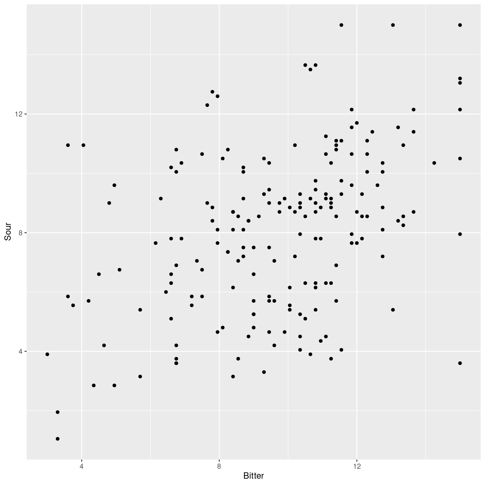

---
# Please do not edit this file directly; it is auto generated.
# Instead, please edit 05-summary-stat.md in _episodes_rmd/
title: "Summary statistics"
teaching: 10
exercises: 5
questions:
- "FIX ME"
objectives:
- "FIX ME"
keypoints:
- "FIX ME"

source: Rmd
math: yes
---

## Summary statistics

I vil ofte skulle finde gennemsnit, medianer, standardafvigelser og
andet for jeres data. Det kalder vi for "Summary statistics" fordi 
vi opsummerer en masse til til en enkelt værdi der (forhåbentlig) karakteriserer
den samlede mængde data. 

Vi har også ofte brug for at beregne eksempelvis gennemsnit af en bestemt variabel
for forskellige grupper. 
Et af de
første eksempler I kommer til at arbejde med er smagsdommeres 
vurderinger af smagen af kaffe. Og en ting man kunne have lyst til at 
finde ud af om de forskellige smagsdommere vurderer bitterheden af 
kaffen forskelligt.

Lad os indlæse data, og få vist de første værdier. `head()`-funktionen giver
os de første seks rækker i datasættet:

~~~
kaffe <- read_excel("../data/Results Panel.xlsx")
head(kaffe)
~~~
{: .language-r}

~~~
# A tibble: 6 × 11
  Sample Assessor Replicate Intensity  Sour Bitter Sweet Tobacco Roasted Nutty
  <chr>     <dbl>     <dbl>     <dbl> <dbl>  <dbl> <dbl>   <dbl>   <dbl> <dbl>
1 31C           1         1      9.3    6.9   6.75  4.5     10.5    7.95  3.9 
2 31C           1         2      8.7    8.1   7.95  4.35     9.6    8.85  4.8 
3 31C           1         3      9.75   8.7  10.2   3.9     10.2   10.2   4.8 
4 31C           1         4     11.7   11.0  11.4   3.15    11.6   10.0   3.45
5 31C           2         1      8.7    5.7  11.4   6.15    10.6    8.85  1.95
6 31C           2         2      8.7    9.3  10.4   4.95    11.7   11.0   5.4 
# ℹ 1 more variable: Chocolate <dbl>
~~~
{: .output}

Man kan få et hurtigt overblik ved hjælp af funktionen `summary`:

~~~
summary(kaffe)
~~~
{: .language-r}

~~~
    Sample             Assessor      Replicate      Intensity     
 Length:192         Min.   :1.00   Min.   :1.00   Min.   : 0.750  
 Class :character   1st Qu.:2.75   1st Qu.:1.75   1st Qu.: 7.650  
 Mode  :character   Median :4.50   Median :2.50   Median : 9.450  
                    Mean   :4.50   Mean   :2.50   Mean   : 9.338  
                    3rd Qu.:6.25   3rd Qu.:3.25   3rd Qu.:11.287  
                    Max.   :8.00   Max.   :4.00   Max.   :15.000  
      Sour            Bitter           Sweet           Tobacco      
 Min.   : 1.050   Min.   : 3.000   Min.   : 0.000   Min.   : 0.900  
 1st Qu.: 5.850   1st Qu.: 7.950   1st Qu.: 1.800   1st Qu.: 7.763  
 Median : 8.400   Median :10.050   Median : 3.450   Median :10.200  
 Mean   : 8.044   Mean   : 9.665   Mean   : 3.553   Mean   : 9.627  
 3rd Qu.:10.050   3rd Qu.:11.400   3rd Qu.: 4.950   3rd Qu.:11.550  
 Max.   :15.000   Max.   :15.000   Max.   :12.000   Max.   :15.000  
    Roasted           Nutty         Chocolate     
 Min.   : 1.200   Min.   :0.600   Min.   : 1.050  
 1st Qu.: 7.463   1st Qu.:2.550   1st Qu.: 5.513  
 Median : 9.750   Median :4.050   Median : 7.350  
 Mean   : 9.101   Mean   :4.154   Mean   : 7.426  
 3rd Qu.:10.988   3rd Qu.:5.287   3rd Qu.: 9.450  
 Max.   :15.000   Max.   :9.900   Max.   :15.000  
~~~
{: .output}
Her får vi minimum og maximum af værdierne i de enkelte kolonner, medianen, 
middelværdien og første samt tredie kvartil.

En lidt irriterende ting ved dette datasæt er at kolonnen `Sample`
indeholder temperaturen. Men angivet ikke som `31` og så underforstået
i grader Celsius, men i stedet som `31C`. Det er selvfølgelig en 
fiks måde at få angivet at vi arbejder med forskellige samples, der
er karakteriseret ved at være ved forskellige temperaturer.
Men det betyder at vi ikke kan lave matematik på temperaturerne, og det har vi 
undertiden lyst til.

> ## Hvordan gør vi så det? 
> 
> Under DATAMANIPULATION så vi hvordan vi kunne lave en ny kolonne, baseret på 
> eksisterende kolonner. Det kan vi udnytte her. Vi vil godt have "beregnet" en 
> ny kolonne der skal hedde "Temperatur", baseret på værdierne i "Sample" kolonnen.
> Sample kolonnen indeholder eksempelvis "31C", og vi vil godt have pillet C'et af,
> så vi har 31 tilbage. Og derefter have konverteret 31 til et tal. Det kan vi gøre
> på denne måde:
> 
> kaffe %>% 
>   mutate(Temperatur = str_remove(Sample, "C")) %>% 
>   mutate(Temperatur = as.numeric(Temperatur))
> 
>Her laver vi en ny kolonne "Temperatur" der indeholder resultatet af at køre 
>`str_remove` funktionen på "Sample". Det vi "remover" er "C". Nu står der "31" i 
> Temperatur kolonnen i stedet for "31C". Men "31" er stadig tekst. Og vi kører derfor
> funktionen "as.numeric" på indholdet af Temperatur kolonnen. Den funktion forvander
> teksten "31" til tallet 31.
{: .callout}

Nu kunne vi så godt tænke os at finde ud af om de otte smagsdommere
vurderer eksempelvis bitterhed forskelligt. Er der nogen af dem
der er mere "følsomme" overfor bitterhed end andre. Det kan vi få en
ide om ved at beregne gennemsnittet af deres vurdering af bitterheden
i kaffen for hver af dommerne.
Måske er vi også interesserede i medianen. Eller standardafvigelsen.

Det kan gøres på flere måder. Vi præsenterer her to. Og vi tager udgangspunkt
i spørgsmålet "Hvad er hver enkelt smagsdommers gennemsnitlige vurdering af 
bitterheden i kaffeprøverne?"

## Aggregate muligheden

Dette er måden at besvare spørgsmålet på, som I præsenteres for i 
undervisningsmaterialet.
Den er lidt bøvlet, og kan være vanskelig at vride hjernen omkring.

Den er på den anden side hurtig og nyttig. Og så er det som nævnt den
der er i undervisningsmaterialet, så det er godt at forstå hvad 
der sker.

Funktion vi bruger hedder `aggregate`. Den er indbygget direkte i R.

~~~
aggregate(kaffe, by=list(kaffe$Assessor), FUN = "mean")
~~~
{: .language-r}

~~~
  Group.1 Sample Assessor Replicate Intensity     Sour   Bitter   Sweet
1       1     NA        1       2.5   9.94375  9.02500  9.63125 3.97500
2       2     NA        2       2.5   9.04375  9.05000 11.58125 1.96250
3       3     NA        3       2.5  10.33125  8.94375 12.08750 4.90625
4       4     NA        4       2.5   7.97500  6.70625  8.43750 2.82500
5       5     NA        5       2.5   8.95625  5.46875  9.25000 3.88125
6       6     NA        6       2.5  11.25625 10.08125 10.71875 4.36250
7       7     NA        7       2.5   8.56875  6.15625  6.28750 2.46875
8       8     NA        8       2.5   8.63125  8.91875  9.32500 4.04375
   Tobacco  Roasted   Nutty Chocolate
1 10.28750 10.20625 4.15000   5.98125
2 11.72500 10.96250 3.41250  10.85625
3 10.36250  8.90625 5.29375  10.23750
4  8.20000  6.58750 3.77500   6.87500
5 10.09375 10.43125 4.49375   6.33750
6  9.72500  7.04375 4.71250   7.72500
7  7.48750  9.05625 3.40625   4.91250
8  9.13750  9.61250 3.98750   6.48125
~~~
{: .output}

Hvad sker der her? Aggregatefunktionen tager input, data, i dette 
tilfælde dataframen `kaffe`, og splitter den op i et antal grupper.
Grupperne er defineret af hvad vi skriver i `by` argumentet, og vi 
får her en gruppe. "Group.1" er Assessor.

I gruppe 1 har vi altså dommerne. De har et nummer fra 1 til 8.
Dernæst beregner `aggregate` gennemsnittet af værdierne i *alle* kolonnerne. Det giver os nogle "warnings", fordi vi ikke kan beregne
et gennemsnit af "31C" og "32C". "31C" er tekst og ikke tal. Og vi kan ikke 
beregne gennemsnit af tekst.

Hvordan skal vi læse dem? Vi skal læse dem som at den gennemsnitlige Bitterhed
som dommer 1 har givet, er 9.63125.

Vil vi beregne andet end gennemsnit, erstatter vi "mean" i `FUN` argumentet med 
en anden statistisk funktion, det kunne være "median" eller "sd" for medianen 
hhv. standardafvigelsen.

Hvis vi godt vil dele datasættet op i flere grupper, eksempelvis både efter
smagsdommer og "Sample", kan vi tilføje det i "by=list" delen af funktionen:

~~~
aggregate(kaffe, by=list(kaffe$Assessor, kaffe$Sample), FUN = "mean") 
~~~
{: .language-r}

~~~
  Group.1 Group.2 Sample Assessor Replicate Intensity    Sour  Bitter  Sweet
1       1     31C     NA        1       2.5    9.8625  8.6625  9.0750 3.9750
2       2     31C     NA        2       2.5    9.0000  8.5125 11.4375 3.3375
3       3     31C     NA        3       2.5    9.2250  9.7500 12.7500 3.6750
4       4     31C     NA        4       2.5    5.7750  6.1500  7.5000 1.9875
5       5     31C     NA        5       2.5    7.0875  6.3375  9.7125 3.3750
6       6     31C     NA        6       2.5    9.6375 10.8000  9.4125 4.1625
  Tobacco Roasted  Nutty Chocolate
1 10.4625  9.2625 4.2375    6.9000
2 11.4375  9.7875 3.3375   10.4625
3 13.5750  6.6375 3.6000    9.1500
4  7.9500  3.8250 2.2500    7.1625
5 10.8750  9.7875 6.1875    7.1250
6 10.7625  6.2625 3.4875    8.1750
~~~
{: .output}
Vi får nu både en "Group.1" der er dommernes nummer, og "Group.2" der er "Sample", 
altså temperaturen. Vi får 48 rækker i alt, fordi vi har 8 dommer og seks
forskellige "Sample" værdier. Og dermed gennemsnitlige værdier for hver af de
kombinationer. Her har vi dog begrænset antallet af rækker der vises til seks
af hensyn til overskueligheden.

Læg mærke til at hvis du selv kører denne kode, får du en række "warnings".
Det skyldes at der er tekst i datasættet, og aggregate vil forsøge at beregne
gennemsnittet, også af tekst. Det kan man ikke, og det giver os advarsler.

## Den anden måde.

Vi er glade for at præsentere forskellige måder at nå samme resultat. De der 
finder aggregate metoden vanskelig, finder forhåbentlig denne let.

I tidyverse universet kan vi opnå de samme aggregerede statiske resultater, blot
på en anden måde:

~~~
kaffe %>% 
  group_by(Assessor) %>% 
  summarise_all(mean)
~~~
{: .language-r}

~~~
Warning: There were 8 warnings in `summarise()`.
The first warning was:
ℹ In argument: `Sample = (function (x, ...) ...`.
ℹ In group 1: `Assessor = 1`.
Caused by warning in `mean.default()`:
! argument is not numeric or logical: returning NA
ℹ Run `dplyr::last_dplyr_warnings()` to see the 7 remaining warnings.
~~~
{: .warning}

~~~
# A tibble: 8 × 11
  Assessor Sample Replicate Intensity  Sour Bitter Sweet Tobacco Roasted Nutty
     <dbl>  <dbl>     <dbl>     <dbl> <dbl>  <dbl> <dbl>   <dbl>   <dbl> <dbl>
1        1     NA       2.5      9.94  9.02   9.63  3.98   10.3    10.2   4.15
2        2     NA       2.5      9.04  9.05  11.6   1.96   11.7    11.0   3.41
3        3     NA       2.5     10.3   8.94  12.1   4.91   10.4     8.91  5.29
4        4     NA       2.5      7.98  6.71   8.44  2.82    8.2     6.59  3.78
5        5     NA       2.5      8.96  5.47   9.25  3.88   10.1    10.4   4.49
6        6     NA       2.5     11.3  10.1   10.7   4.36    9.72    7.04  4.71
7        7     NA       2.5      8.57  6.16   6.29  2.47    7.49    9.06  3.41
8        8     NA       2.5      8.63  8.92   9.32  4.04    9.14    9.61  3.99
# ℹ 1 more variable: Chocolate <dbl>
~~~
{: .output}

Hvad sker der? Vi tager vores data, `kaffe` og bruger pipen til at sende 
data til funktionen `group_by`. Den "grupperer" datasættet efter værdierne i "Assessor".
Dette grupperede datasæt sendes videre til `summarise_all` funktionen, der beregner
middelværdien - den specificerer vi med "mean", for *alle* kolonnerne.

Der er flere varianter af den. Hvis vi vil fokusere på vurderingen af "Intensity",
kan vi beregne flere statistiske værdier for den på en gang:

~~~
kaffe %>% 
  group_by(Assessor) %>% 
  summarise(middelværdi = mean(Intensity),
            medianen  = median(Intensity),
            std_afv = sd(Intensity)
            )
~~~
{: .language-r}

~~~
# A tibble: 8 × 4
  Assessor middelværdi medianen std_afv
     <dbl>       <dbl>    <dbl>   <dbl>
1        1        9.94    10.1     1.57
2        2        9.04     9       2.07
3        3       10.3     11.1     2.93
4        4        7.98     8.7     2.50
5        5        8.96     9.3     1.66
6        6       11.3     11.5     1.78
7        7        8.57     8.85    2.46
8        8        8.63     9.38    4.16
~~~
{: .output}
Her bruger vi `summarise` i stedet for `summarise_all`, fordi det ikke er alle
kolonner vi vil lave beregninger på, men kun dem vi specificerer.

Og hvis vi vil opdele vores data efter mere end en parameter, Assessor og Sample
for eksempel, kan vi tilføje de ekstra grupperings variable i `group_by`:

~~~
kaffe %>% 
  group_by(Assessor, Sample) %>% 
  summarise(middelværdi = mean(Intensity),
            medianen  = median(Intensity),
            std_afv = sd(Intensity)
            )
~~~
{: .language-r}

~~~
# A tibble: 48 × 5
# Groups:   Assessor [8]
   Assessor Sample middelværdi medianen std_afv
      <dbl> <chr>        <dbl>    <dbl>   <dbl>
 1        1 31C           9.86     9.52   1.30 
 2        1 37C          10.3     10.4    0.605
 3        1 44C           7.72     8.1    1.92 
 4        1 50C          10.7     11.0    0.928
 5        1 56C          10.4     10.2    1.01 
 6        1 62C          10.6     11.2    1.67 
 7        2 31C           9        8.7    1.16 
 8        2 37C           7.95     7.95   3.21 
 9        2 44C           8.06     8.4    3.07 
10        2 50C          10.7     11.1    1.14 
# ℹ 38 more rows
~~~
{: .output}

## En lineær regression

To variable varierer sammen. Plotter vi det kunne det se således
ud:

~~~
kaffe %>% 
  ggplot(aes(Bitter, Sour)) +
  geom_point()
~~~
{: .language-r}

plot of chunk unnamed-chunk-9

Indrømmet måske ikke den mest overbevisende lineære
sammenhæng mellem vurderingen af "Bitter" og "Sour".
Men der er noget.

I en lineær regression, forsøger vi, i dette tilfælde,
at forklare variationen i vurderingen af "Sour", ved
hjælp af variationen i "Bitter". Hvis "Bitter" stiger
med "1", hvor meget stiger "Sour" så med.

Med andre ord, vi vil finde den bedste rette linie at
lægge ind i plottet. Sådan en ret linie beskriver vi
som regel med udtrykket $$y = ax + b$$. Eller:

$$Sour = a*Bitter + b$$

Vil vi have R til at lave beregningerne for os, fortæller vi R hvilken lineære model vi vil fitte data
til. Og hvilke data vi arbejder med:

~~~
model <- lm(Sour ~ Bitter, data = kaffe)
~~~
{: .language-r}

Den første del af funktionen, `Sour ~ Bitter` specificerer
at vi vil beskrive værdierne af `Sour` som funktion af
`Bitter`, i datasættet `kaffe`.

Ser vi på outputtet af det - vi gemte resultatet i
objektet `model` får vi følgende:

~~~
model
~~~
{: .language-r}

~~~

Call:
lm(formula = Sour ~ Bitter, data = kaffe)

Coefficients:
(Intercept)       Bitter  
     3.8600       0.4329  
~~~
{: .output}
Hvilket vi kan læse som:
$$Sour = 0.4329*Bitter + 3.8600$$. Og altså som at
hvis en smagsdommer vurderer bitterheden af kaffen til 
at være 13.2, så forudsiger vores model at smagsdommeren
vil vurdere surheden til at være: $$Sour = 0.4329*13.2 + 3.8600 = 9.57428$$.

Vi kan se flere detaljer:

~~~
summary(model)
~~~
{: .language-r}

~~~

Call:
lm(formula = Sour ~ Bitter, data = kaffe)

Residuals:
    Min      1Q  Median      3Q     Max 
-6.7533 -1.9351  0.1727  1.5054  6.1402 

Coefficients:
            Estimate Std. Error t value Pr(>|t|)    
(Intercept)  3.85995    0.68098   5.668 5.29e-08 ***
Bitter       0.43289    0.06795   6.371 1.39e-09 ***
---
Signif. codes:  0 '***' 0.001 '**' 0.01 '*' 0.05 '.' 0.1 ' ' 1

Residual standard error: 2.496 on 190 degrees of freedom
Multiple R-squared:  0.176,	Adjusted R-squared:  0.1717 
F-statistic: 40.59 on 1 and 190 DF,  p-value: 1.386e-09
~~~
{: .output}
Her ser vi koefficienterne fra den rette linies ligning, og får også
p-værdierne for dem. Forskellige statistiske tests kalder p-værdien forskellige ting. Her bruges "Pr".

Bemærk at de meget fine p-værdier ikke i sig selv fortæller at der er en sammenhæng, blot at vi med stor sikkerhed kan afvise at koefficienterne skulle være 0.

Bemærk også at $$R^2$$ kun er 0.176, hvilket kan tolkes som at denne lineære model
forklarer 17.6% af variationen i `Sour`. Fantastiske p-værdier, elendig model!

Det allerførste vi ser ovenfor, er statistik på `residualerne`. Det kan vi forstå
som den del af variationen af `Sour`, der ikke forklares af den lineære model. I eksemplet ovenfor, hvor en smagsdommer vurderede
"bitter" til 13.2 forudså modellen at samme smagsdommer skulle vurdere "Sour" til 9.57428. Kigger vi i data, kan vi finde en 
smagsdommer der faktisk vurderer "Bitter" til 13.2. Men samme smagsdommers vurdering af "Sour" er faktisk 11.6. 11.6 - 9.57428 er forskellen på de faktiske data, og det vores lineære model forudsiger. Eller "residualen", den del af variationen i "Sour" som modellen *ikke* forklarer.


