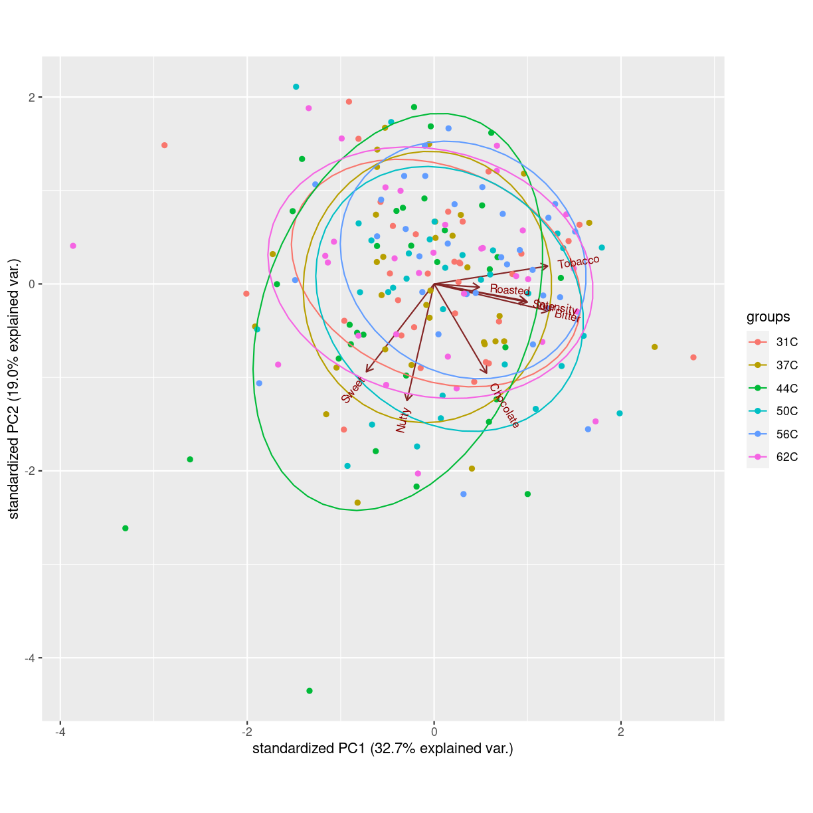

---
# Please do not edit this file directly; it is auto generated.
# Instead, please edit 06-ggplot.md in _episodes_rmd/
title: "Lidt ggplot"
teaching: 10
exercises: 5
questions:
- "Hvad er ggplot?"
objectives:
- "Introduktion til den grundlæggende struktur i ggplot"
keypoints:
- "ggplot kan plotte stort set alle former for 2D plots"

source: Rmd
math: yes
---

I kommer til at arbejde med flere forskellige datasæt, men det et af de første
I støder på handler om kaffe. Lad os indlæse datasættet og kigge på det. Allerførst
skal vi have indlæst de biblioteker vi kommer til at arbejde med:

~~~
library(tidyverse)
library(readxl)
library(ggbiplot)
~~~
{: .language-r}
Og så skal vi have indlæst data. Dem downloadede vi tidligere og gemte i "data"
mappen:

~~~
kaffe <- read_excel("data/Results Panel.xlsx")
~~~
{: .language-r}

Under "summary statistics" så vi ultrakort hvordan man kunne plotte to variable
mod hinanden:

~~~
kaffe %>% 
  ggplot(mapping = aes(x = Bitter, y = Sour)) +
  geom_point()
~~~
{: .language-r}

plot of chunk Plot af Sour mod Bitter

Men vi talte ikke meget om hvad den kode egentlig betød.

R har indbyggede funktioner til at plotte data, og de er ret gode. Men det er 
vanskeligt at bruge dem hvis man vil justere på farver, skalaer og andet. 
Pakken `ggplot2` er inkluderet i pakken `tidyverse`. Den kan bruges til at lave 
(næsten) enhver type to-dimensionelle plots. 

Funktionen der gør det, hedder `ggplot`. Lad jer ikke forvirre, `ggplot2` er 
pakken der indeholder funktionen `ggplot`.

`ggplot` skal have noget data. Det får den fra pipen, der sender `kaffe` videre
til `ggplot`. Det næste `ggplot` skal vide er hvordan vi vil "mappe" data til 
ting i plottet. Der gør vi ved en lille hjælpefunktion, `aes`, der specificerer
at vi vil have værdierne i "Bitter" kolonnen på x-aksen, og værdierne i "Sour"
kolonnnen på y-aksen. Vi kan "mappe" data til andre ting i plottet, men starter
med disse to. 

Koden:

~~~
kaffe %>% 
  ggplot(mapping = aes(x = Bitter, y = Sour))
~~~
{: .language-r}

producerer et meget kedeligt plot, for vi har ikke tilføjet laget der fortæller 
hvordan vi vil have plottet data. Det gør vi med funtionen `geom_point`, der
specificerer at vi vil have et scatter-plot, hvor vi plotter punkter, eller "points".

Vi kan tænke på den måde `ggplot2` laver plots, som at vi lægger lag på lag. 
Der startes med et lag hvor det beskrives hvilke data der er i plottet, og hvilke
af dem der skal være på x og y akserne. Når vi vil specificere hvordan data så 
faktisk _skal_ plottes, tilføjer vi et ekstra lag oven på plottet, med `+`. 

Det lag vi tilføjer, som specificerer hvordan data konkret skal plottes, 
kaldes en `geom_` - kort for geometri, fordi det i en eller anden forstand er 
geometriske objekter vi plotter.

Forskellige typer af plots har hver deres `geom_` funktion, hvor det der står efter
understregningen, fortæller hvilken slags plot vi vil have lavet. Det samlede 
plot bliver derfor:

~~~
kaffe %>% 
  ggplot(aes(x = Bitter, y = Sour)) +
  geom_point()
~~~
{: .language-r}

som vi så tidligere.

Andre `geom_` funktioner der kan være nyttige er:

### Boxplots

~~~
kaffe %>% 
  ggplot(aes(x = Sample, y = Sour)) +
  geom_boxplot()
~~~
{: .language-r}

plot of chunk unnamed-chunk-8

Boxplottet viser os fordelingen af vurdering af parameteren "Sour" ved forskellige 
temperaturer. 

### Biplots 

Et særligt plot I kommer til at bruge meget er et `biplot`. Det kan R også lave
direkte, men det er lettere med funktionen `ggbiplot` som vi installerede i episoden "Pakker og opdatering".

Udgangspunktet er resultatet af en "principal component analyse". Det kommer vi ikke ind
på her - det forklarer Morten meget bedre end os. Men den kode der skal laves 
ser således ud:

~~~
kaffe.pca <- prcomp(kaffe[,4:11], scale. = TRUE)
ggbiplot(kaffe.pca, groups = kaffe$Sample, ellipse = TRUE)
~~~
{: .language-r}

plot of chunk Biplot

Den første linie laver selve PCA-modellen. Den plotter vi så efterfølgende med
`ggbiplot()` funktionen.

Den skal først have modellen der skal plottes, det er `kaffe.pca`. Hvis vi vil 
havelagt punkterne efter hvilken gruppe de hører til, skal vi angive det med `groups` 
argumentet. Her farvelægger vi efter værdierne i kolonnen "Sample" i datasættet.
`ellipse` angiver at der skal tegnes en ellipse omkring punkterne i hver gruppe.
Som default tegnes ellipsen så den omfatter ca. 95% af observationerne.


