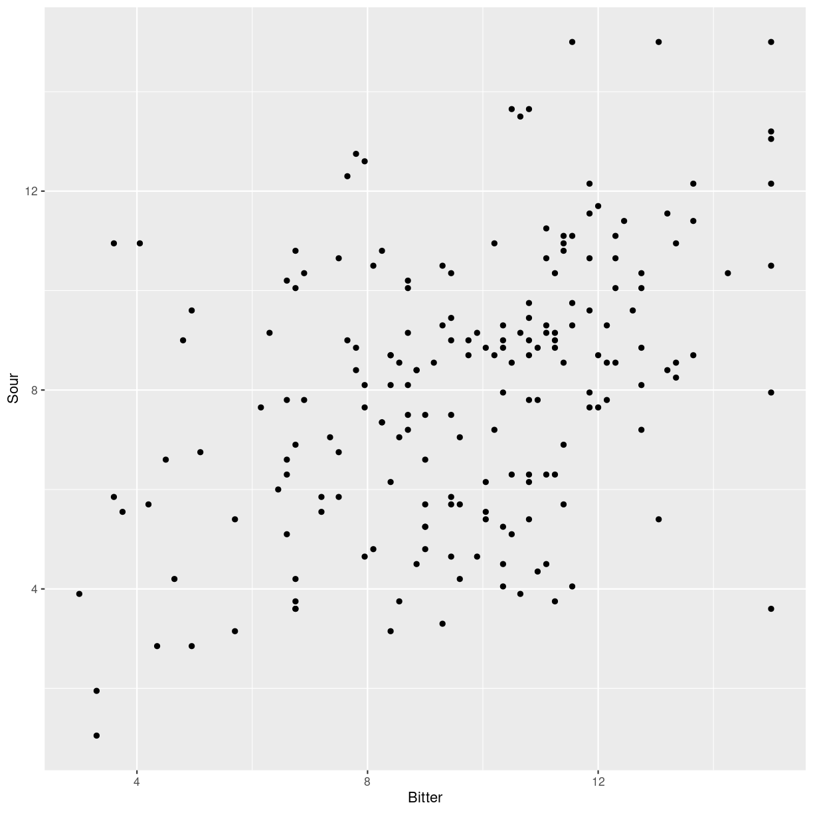

---
# Please do not edit this file directly; it is auto generated.
# Instead, please edit 06-ggplot.md in _episodes_rmd/
title: "Lidt ggplot"
teaching: 10
exercises: 5
questions:
- "Hvad er ggplot?"
objectives:
- "FIX ME"
keypoints:
- "FIX ME"

source: Rmd
math: yes
---

I kommer til at arbejde med flere forskellige datasæt, men det et af de første
I støder på handler om kaffe. Lad os indlæse datasættet og kigge på det. Allerførst
skal vi have indlæst de biblioteker vi kommer til at arbejde med:

~~~
Loading required package: usethis
~~~
{: .output}

~~~
Using github PAT from envvar GITHUB_PAT
~~~
{: .output}

~~~
Skipping install of 'ggbiplot' from a github remote, the SHA1 (7325e880) has not changed since last install.
  Use `force = TRUE` to force installation
~~~
{: .output}

~~~
library(tidyverse)
~~~
{: .language-r}

~~~
── Attaching core tidyverse packages ──────────────────────── tidyverse 2.0.0 ──
✔ dplyr     1.1.2     ✔ readr     2.1.4
✔ forcats   1.0.0     ✔ stringr   1.5.0
✔ ggplot2   3.4.2     ✔ tibble    3.2.1
✔ lubridate 1.9.2     ✔ tidyr     1.3.0
✔ purrr     1.0.1     
── Conflicts ────────────────────────────────────────── tidyverse_conflicts() ──
✖ dplyr::filter() masks stats::filter()
✖ dplyr::lag()    masks stats::lag()
ℹ Use the conflicted package (<http://conflicted.r-lib.org/>) to force all conflicts to become errors
~~~
{: .output}

~~~
library(readxl)
library(ggbiplot)
~~~
{: .language-r}

~~~
Loading required package: plyr
------------------------------------------------------------------------------
You have loaded plyr after dplyr - this is likely to cause problems.
If you need functions from both plyr and dplyr, please load plyr first, then dplyr:
library(plyr); library(dplyr)
------------------------------------------------------------------------------

Attaching package: 'plyr'

The following objects are masked from 'package:dplyr':

    arrange, count, desc, failwith, id, mutate, rename, summarise,
    summarize

The following object is masked from 'package:purrr':

    compact

Loading required package: scales

Attaching package: 'scales'

The following object is masked from 'package:purrr':

    discard

The following object is masked from 'package:readr':

    col_factor

Loading required package: grid
~~~
{: .output}

~~~
kaffe <- read_excel("../data/Results Panel.xlsx")
~~~
{: .language-r}

Under "summary statistics" så vi ultrakort hvordan man kunne plotte to variable
mod hinanden:

~~~
kaffe %>% 
  ggplot(aes(x = Bitter, y = Sour)) +
  geom_point()
~~~
{: .language-r}

plot of chunk unnamed-chunk-5

Men vi talte ikke meget om hvad den kode egentlig betød.

R har indbyggede funktioner til at plotte data, og de er ret gode. Men det er 
vanskeligt at bruge dem hvis man vil justere på farver, skalaer og andet. 
Pakken `ggplot2` er inkluderet i pakken `tidyverse`. Den kan bruges til at lave 
(næsten) enhver type to-dimensionelle plots. 

Funktionen der gør det, hedder `ggplot`. Lad jer ikke forvirre, `ggplot2` er 
pakken der indeholder funktionen `ggplot`.

`ggplot` skal have noget data. Det får den fra pipen, der sender `kaffe` videre
til `ggplot`. Det næste `ggplot` skal vide er hvordan vi vil "mappe" data til 
ting i plottet. Der gør vi ved en lille hjælpefunktion, `aes`, der specificerer
at vi vil have værdierne i "Bitter" kolonnen på x-aksen, og værdierne i "Sour"
kolonnnen på y-aksen. Vi kan "mappe" data til andre ting i plottet, men starter
med disse to. 

ggplot bruger en abstraktion om lag. Vi lægger ekstra lag oven på vores plots 
med `+`. Koden:

~~~
kaffe %>% 
  ggplot(aes(x = Bitter, y = Sour))
~~~
{: .language-r}

producerer et meget kedeligt plot, for vi har ikke tilføjet laget der fortæller 
hvordan vi vil have plottet data. Det gør vi med funtionen `geom_point`, der
specificerer at vi vil have et scatter-plot, hvor vi plotter punkter, eller "points".

Forskellige typer af plots har hver deres `geom_` funktion, hvor det der står efter
understregningen, fortæller hvilken slags plot vi vil have lavet. Det samlede 
plot bliver derfor:

~~~
kaffe %>% 
  ggplot(aes(x = Bitter, y = Sour)) +
  geom_point()
~~~
{: .language-r}

som vi så tidligere.

Andre `geom_` funktioner der kan være nyttige er:

### boxplot

~~~
kaffe %>% 
  ggplot(aes(x = Sample, y = Sour)) +
  geom_boxplot()
~~~
{: .language-r}

plot of chunk unnamed-chunk-8

Boxplottet viser os fordelingen af vurdering af parameteren "Sour" ved forskellige 
temperaturer. 

Et særligt plot I kommer til at bruge meget er et `biplot`. Det kan R også lave
direkte, men det er lettere med funktionen `ggbiplot` som vi installerede i episoden "Pakker og opdatering".

Udgangspunktet er en 

~~~
kaffe.pca <- prcomp(kaffe[,4:11], scale. = TRUE)
biplot <- ggbiplot(kaffe.pca, obs.scale = 1, var.scale = 1, groups = kaffe$Sample, ellipse = TRUE, circle = TRUE)
 biplot
~~~
{: .language-r}

plot of chunk unnamed-chunk-9


